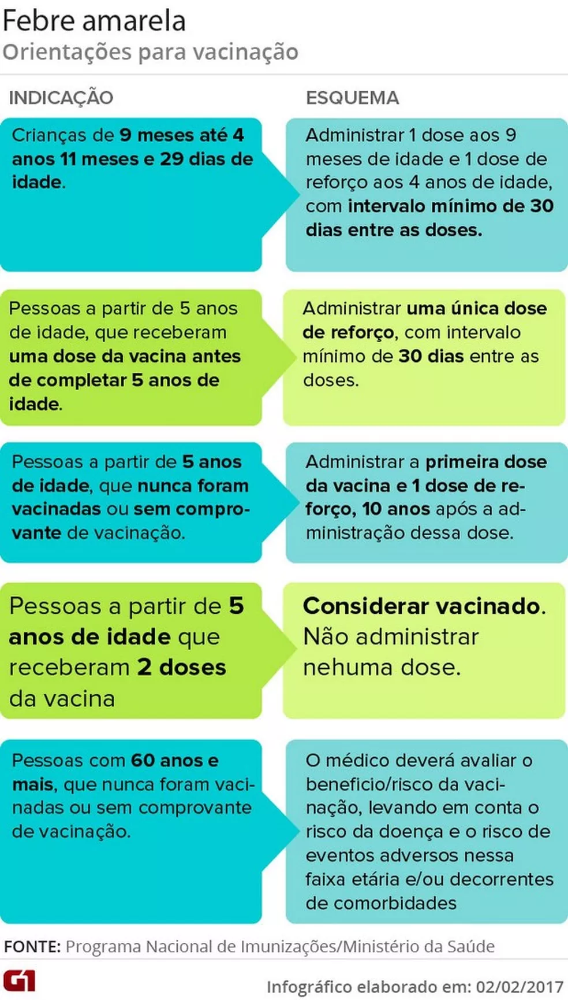

# Uso de Modelagem Epidemiológica SIRD para identificar padrões epidemiológicos da Febre Amarela na Região Sudeste

As arboviroses são doenças virais transmitidas por artrópodes, majoritariamente mosquitos. Dentre elas, as que apresentam maiores ocorrências são a Chikungunya, Dengue, Febre Amarela e Zika, todas transmitidas pelo Aedes aegypti. Nesse contexto, o aprendizado de máquinas pode ser uma ferramenta crucial para realizar análises epidemiológicas dessas doenças, mais especificamente a Febre Amarela (FA) em determinados centros urbanos do Brasil. Neste trabalho, o foco será direcionado à região de Minas Gerais. A abordagem adotada consistirá na implementação de algoritmos de Aprendizado de Máquinas em bases de dados de saúde para prever como ocorre o espalhamento dessa doença e quais são os grupos sociais mais afetados por ela. Para isso, serão utilizados os métodos de Regressão Linear, Árvore de Decisãoe e Floresta Aleatória, junto às métricas utilizadas para avaliar a acurácia desses dados, como RMSE (Root Mean Square Error), MAPE (Mean Absolute Percentage Error) e Mean Absolute Error (MAE).

fonte: https://g1.globo.com/bemestar/febre-amarela/noticia/ministerio-confirma-243-casos-de-febre-amarela-208-foram-em-minas-gerais.ghtml
