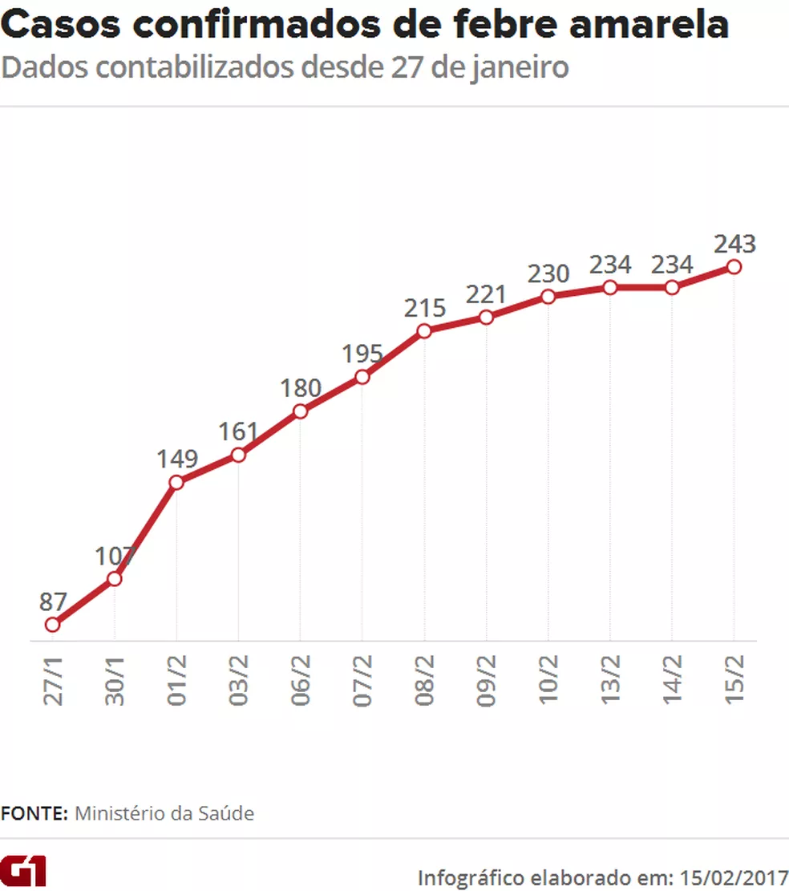

# Uso de Modelagem Epidemiológica SIRD para identificar padrões epidemiológicos da Febre Amarela na Região Sudeste

A \textbf{Febre Amarela (FA)} representa uma enfermidade infecciosa de considerável gravidade, desencadeada por um vírus pertencente ao gênero Flavivirus. \cite{febreamarela}. Num contexto mais abrangente e regional, observa-se que a FA é uma enfermidade presente nas Américas do Sul e Central, além de alguns países africanos. Sua propagação tem sido registrada tanto em áreas urbanas quanto em ambientes selvagens dessas regiões.  \cite{Febreama19}.
 

Em 2017, Bio-Manguinhos, o braço do Instituto Tecnológico em Imunobiológicos pertencente à Fundação Oswaldo Cruz (Fiocruz) e o único fabricante nacional de vacinas, ampliou sua produção mensal de 4 milhões para 6 milhões de doses de vacina. \cite{Examinan66}. Contudo, a produção ainda não atende à rápida propagação da febre amarela silvestre. Desde novembro de 2016, o vírus causador da doença se disseminou velozmente na região Sudeste que estava previamente isentas da doença.\cite{Examinan66}. Embora a vacina contra a Febre Amarela esteja disponível no Sistema Único de Saúde (SUS) desde 1937, são frequentes os surtos da doença no Brasil, especialmente na região Sudeste. Assim, é fundamental \textbf{estudar a propagação e o comportamento da Febre Amarela por meio da modelagem matemática}, visando estabelecer bases para pesquisas futuras. 

\section*{Objetivos}

O principal objetivo deste estudo é empregar técnicas de modelagem matemática e métodos de aproximação para descrever e analisar o impacto da FA na região Sudeste usando técnicas aprendidas na disciplina de biomatemática. Este trabalho se propõe a aplicar o modelo matemático SIRD,  uma extensão do modelo SIR e utilizar o método de aproximação RK4 (Método de Runge-Kutta de ordem 4) para simplificar e resolver o modelo proposto, permitindo uma análise mais acessível e eficiente. Além disso, analisar a influência dos parâmetros críticos no contexto do modelo utilizado, destacando como as suas variações afetam o comportamento do sistema modelado e comparar com dados empíricos para verificar a acurácia do modelo abordado.
Ao atingir esses objetivos, pretendemos oferecer uma representação matemática aproximada do problema em estudo e fornecer mais formas para a compreensão do fenômeno, da área da biomatemática e potencialmente contribuir para o desenvolvimento de estratégias eficazes na resolução de problemas práticos nesta área.

fonte: https://g1.globo.com/bemestar/febre-amarela/noticia/ministerio-confirma-243-casos-de-febre-amarela-208-foram-em-minas-gerais.ghtml
